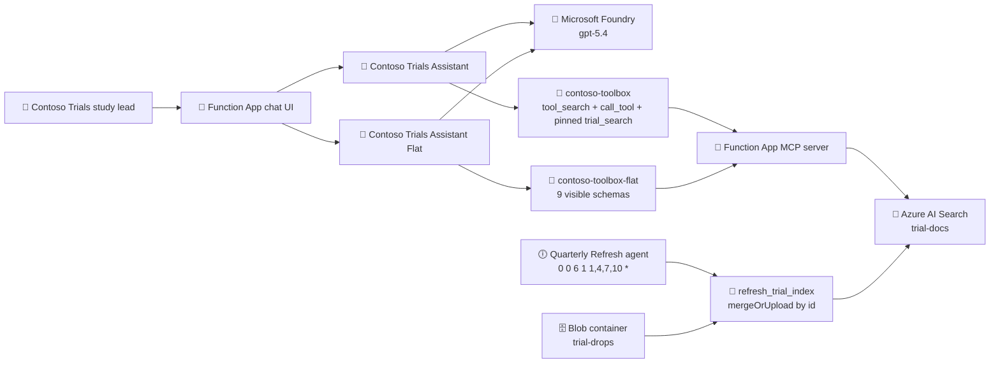

Snowflake Cortex is generating over the warehouse and often takes 1 to 2 minutes. This Contoso Trials demo retrieves a pre-built drug summary from Azure AI Search through one pinned toolbox tool, and uses tool search so the other tools do not inflate the prompt. The Functions timer is the quarterly publish. Freshness is the refresh, not a cache of tool results.

# Contoso Trials demo

## Deployment status: live in Canada Central

The first required deployment targeted `eastus2`. Azure AI Search provisioning failed for regional capacity. The user then authorized a Canada retry, which succeeded in `canadacentral` in a separate resource group. The failed eastus2 resources are preserved.

**Exact Azure error**

```text
InsufficientResourcesAvailable: The region 'eastus2' is currently out of the resources required to provision new services. Try creating the service in another region. RequestId: c65b9d7a-26c5-0015-446b-6f1f1bd00153
```

The failed resource was `srch-contosotrials-37ivp6t76q` in `rg-contoso-trials-eastus2`. The user then explicitly authorized a Canada retry. No model or SKU was changed.

The Canadian deployment completed infrastructure provisioning, Function App publishing, Search loading, toolbox creation, agent runs, quarterly refresh, and trace validation. The initial toolbox attempt returned the following RBAC error:

```text
HTTP 403 UserError:
Identity(object id: a5745173-5ef4-4a46-a7e3-5ed39e5cc302) does not have permissions
for Microsoft.CognitiveServices/accounts/AIServices/agents/write actions.
```

After the deploying identity received the Foundry data-plane role and the assignment propagated, both toolboxes were created and validated. Azure AI Search Entra data-plane authentication was also enabled explicitly with `authOptions.aadOrApiKey`.

## Required support check

Checked before deployment and revalidated for `canadacentral`.

| Check | Region evidence | Model/tool evidence | Result |
|---|---|---|---|
| Microsoft Foundry Agent Service | Supported | Supported agent model | Pass |
| Azure AI Search agent tool | Supported | Supported | Pass |
| MCP, required to consume a Foundry toolbox | Supported | Supported | Pass |
| Foundry toolbox tool search | Supported through `toolbox_search`; exposes `tool_search` and `call_tool` | Compatible through MCP | Pass |
| Azure AI Search service allocation in this subscription at deployment time | Capacity request failed | Not applicable | **Blocked** |
| Azure AI Search service allocation in `canadacentral` | `srch-contosotrials-5legl5fcrx` created | `gpt-5.4` deployed | Pass |

Sources:

- [Foundry tool and model support](https://learn.microsoft.com/en-us/azure/foundry/agents/concepts/limits-quotas-regions#tool-support-by-region-and-model)
- [Foundry tool search](https://learn.microsoft.com/en-us/azure/foundry/agents/how-to/tools/tool-search)
- [Tool best practices](https://learn.microsoft.com/en-us/azure/foundry/agents/concepts/tool-best-practice)

## Sample baseline and changes

The sample was verified before editing:

- `infra/main.bicep` created the resource group, managed identity, Function App, storage, Foundry account/project, and model deployment.
- `infra/app/foundry.bicep` created the Foundry account/project and `gpt-5.4`.
- `infra/app/api.bicep` created the Flex Consumption Function App.
- `azure.yaml` deployed the Python Function App from `src`.
- `src/mcp.json` contained only the Microsoft Learn MCP server.
- The baseline did **not** create Azure AI Search or a Foundry toolbox.

The extension now adds:

- `infra/app/search.bicep` for a Basic Azure AI Search service with semantic ranker.
- Search and storage RBAC for the Function App managed identity.
- `scripts/provision_data.py` for the `trial-docs` schema, exactly 2,000 parents plus 8,000 child chunks, and the `2026Q2` blob drop.
- `src/contoso_mcp.py` for `trial_search` and eight comparison-only tools.
- `scripts/provision_toolboxes.py` for `contoso-toolbox` and `contoso-toolbox-flat`.
- `src/quarterly_refresh.agent.md` plus the Python `refresh_trial_index` tool.
- A Function-key protected `POST /quarterly-refresh` route that calls the Python refresh directly.

## Architecture



The toolbox does not cache query results. Every `tools/call` still runs. Tool search reduces input tokens by hiding unused tool definitions.

## Canadian resources

| Resource | Name | State |
|---|---|---|
| Resource group | `rg-contoso-trials-canadacentral` | Created |
| Foundry account | `cog-contosotrials-5legl5fcrx` | Created |
| Foundry project | `cog-contosotrials-5legl5fcrx-proj` | Created |
| Foundry project endpoint | `https://cog-contosotrials-5legl5fcrx.services.ai.azure.com/api/projects/cog-contosotrials-5legl5fcrx-proj` | Recorded |
| Foundry model | `gpt-5.4`, version `2026-03-05`, `GlobalStandard` | Succeeded |
| Storage account | `stcontosotrl5legl5fcrx` | Created |
| Log Analytics | `log-contoso-trials-5legl5fcrx` | Created |
| Application Insights | `appi-contoso-trials-5legl5fcrx` | Created |
| Azure AI Search | `srch-contosotrials-5legl5fcrx` | Created |
| Function App | `func-contoso-trials-5legl5fcrx` | Published |
| Function App URL | `https://func-contoso-trials-5legl5fcrx.azurewebsites.net/` | Recorded |
| Tool-search chat UI | `https://func-contoso-trials-5legl5fcrx.azurewebsites.net/agents/trial_assistant/` | Live; Function key required |
| Flat chat UI | `https://func-contoso-trials-5legl5fcrx.azurewebsites.net/agents/trial_assistant_flat/` | Live; Function key required |
| Foundry tool-search prompt agent | `contoso-trials-tool-search-agent`, version `1` | Active |
| Foundry flat-toolbox prompt agent | `contoso-trials-flat-toolbox-agent`, version `1` | Active |

No unrelated resources were deleted.

## Index design

The deployed index name is `trial-docs`.

- Parent unit: one summary per drug + study + quarter.
- Child units: protocol excerpt, safety review, efficacy table note, and eligibility rule.
- Generated live set: exactly 2,000 parent summaries and 8,000 chunks across 40 synthetic drugs, 200 studies, and quarters `2025Q1` through `2026Q1`.
- Generated chunk size: 729-837 words, approximately the requested 800-1,200 token range.
- Fields: `id`, `parent_id`, `drug_name`, `study_id`, `phase`, `quarter`, `doc_type`, `title`, `section`, `content`, `sponsor_name`, `summary_boost`, and `source_url`.
- Semantic configuration: title plus section/content, with drug/study/quarter keywords.
- Scoring profile: `summary-first` uses a static `summary_boost` field so overview queries prefer parent summaries without asking the model to scan the corpus.
- Retrieval applies `drug_name`, `study_id`, or `quarter` filters before semantic ranking.

The optional `content_vector` field is intentionally omitted because this implementation uses semantic search and does not deploy a separate embedding model.

### Production scale note

At 15 million row-level records, the indexed unit is still the summary and the chunk, not the row. Land row-level data in storage, build parent summaries and section chunks on the quarterly run, index those, and filter by `drug_name` or `study_id` before semantic rank. A 15 million row source might produce a few hundred thousand chunks. Cortex-style generation over the full table is the pattern this demo replaces.

## Synthetic grounding canaries

- `DRUG-CANARY-AXIMAB`: Axumab, `STD-1044`, safety review, serious infection rate 1.8 percent, hold rules in section 6.2.
- `DRUG-CANARY-BELVEX`: Belvex, `STD-2201`, efficacy, primary endpoint met, hazard ratio 0.74.
- `DRUG-CANARY-CORYL`: Coryl, `STD-3301`, eligibility, eGFR at least 45, excluded for prior biologic use within 90 days.
- `DRUG-CANARY-AXIMAB-Q2`: Axumab, `STD-1044`, `2026Q2`, changed serious infection rate from 1.8 percent to 1.5 percent.

Every generated document has sponsor `Contoso Trials` and is labeled synthetic Contoso Trials data.

## Quarterly refresh

- Agent: `src/quarterly_refresh.agent.md`
- Cron: `0 0 6 1 1,4,7,10 *`
- Schedule: 06:00 UTC on the first day of January, April, July, and October.
- Python tool: `refresh_trial_index`
- Blob container: `trial-drops`
- Seed blob: `2026Q2/axumab-STD-1044.json`
- Write behavior: `mergeOrUpload` by stable `id`; never delete the index.
- Live route: `POST https://<function-app>.azurewebsites.net/quarterly-refresh`

The refresh is the only write path. Search output is untrusted read-only evidence and is never promoted into a write.

## Toolbox design

`contoso-toolbox`:

- `toolbox_search` enabled.
- Initial `tools/list` must contain `tool_search`, `call_tool`, and pinned `trial_search` only.
- The other eight tools remain hidden until discovered.

`contoso-toolbox-flat`:

- Tool search disabled.
- Initial `tools/list` must contain all nine tools.
- The eight unused tools have intentionally long descriptions only to make the flat schema prompt measurably larger. This is not recommended production style.

The Function App MCP server exposes:

1. `trial_search`
2. `list_studies`
3. `get_site_status`
4. `list_deviations`
5. `get_lab_trend`
6. `draft_csr_section`
7. `lookup_visit_window`
8. `safety_narrative`
9. `regulatory_clock`

The consumer token scope is `https://ai.azure.com/.default`.

Foundry IQ knowledge base creation was skipped because it was not needed for the Search-backed toolbox demonstration. The Function App MCP endpoint was registered as the `contoso-trials-tools` Foundry project connection.

### Saved Foundry prompt agents

`foundry-agents/azure.yaml` deploys two persistent prompt agents into the same Foundry project:

- `contoso-trials-tool-search-agent` uses the version 3 tool-search toolbox MCP endpoint.
- `contoso-trials-flat-toolbox-agent` uses the version 2 flat toolbox MCP endpoint.

Both use `gpt-5.4`, `tool_choice: required`, low reasoning effort, and project-managed-identity RemoteTool connections. The project managed identity has `Foundry User` on the account and project scopes.

Native prompt-agent toolbox attachment was attempted first and returned:

```text
Agent creation with kind 'prompt' and harness type 'github_copilot_preview'
is not enabled for this subscription.
```

The deployed agents use the supported MCP consumer endpoints instead. This still exercises the two actual toolbox versions and does not duplicate their tool schemas in the agent definitions. Both agents were invoked with the Axumab safety question and returned cited `STD-1044` evidence and section 6.2 hold rules.

### Toolbox REST command

Toolboxes are data-plane Foundry resources, not a resource type in the Bicep API used by this sample. After a successful `azd up`, `scripts/provision_toolboxes.py` creates the remote-tool connection through ARM (`2025-06-01`) and then performs the equivalent of this command for each toolbox:

```bash
az rest \
  --method post \
  --url "$FOUNDRY_PROJECT_ENDPOINT/toolboxes/contoso-toolbox/versions?api-version=v1" \
  --body @contoso-toolbox.json
```

The request body contains `{"type":"toolbox_search"}` and an MCP tool with `tool_configs.trial_search.pin=true`. The flat request omits `toolbox_search` and `tool_configs`.

## Agent decision rules

Both assistant files name every available tool and enforce this overlap rule:

> Use `trial_search` for any drug, study, safety, efficacy, or eligibility question. Do not use web search or general knowledge for Contoso Trials facts. If retrieval returns nothing or fails, say so and ask a narrower follow-up. Never invent a rate.

The tool returns only `drug`, `study_id`, `quarter`, `section`, and `cited_passage`.

## Demo prompts

1. `Give me a safety summary for Axumab and what the hold rules are.`
2. `Did Belvex meet its primary endpoint, and what was the hazard ratio?`
3. `Which patients would fail Coryl screening on renal function or recent biologic use?`
4. `After the refresh: what changed in the latest Axumab safety review?`

## Required verification evidence

| Check | Required result | Actual result |
|---|---|---|
| `trial-docs` count before refresh | `10000` | **10,000 uploaded** |
| `trial-docs` count after refresh | `10005` | **10,005** |
| Tool-search `tools/list` | `tool_search`, `call_tool`, pinned search only | **3 schemas:** `tool_search`, `call_tool`, `contoso-trials-tools___trial_search` |
| Flat `tools/list` | Nine schemas | **9 schemas**, including all comparison tools |
| Tool-search Axumab answer | Contains `DRUG-CANARY-AXIMAB` | Pass |
| Flat Axumab answer | Contains `DRUG-CANARY-AXIMAB` | Pass |
| Belvex answer | Contains `DRUG-CANARY-BELVEX` | Pass; endpoint met, hazard ratio `0.74` |
| Coryl answer | Contains `DRUG-CANARY-CORYL` | Pass; eGFR at least `45`, prior biologic within `90` days excluded |
| Trace | `trial_search`, exact arguments, canary in tool output | Pass; see trace evidence below |
| HTTP refresh | Successful merge | Pass; `5` documents merged |
| Post-refresh Axumab answer | Contains `DRUG-CANARY-AXIMAB-Q2` | Pass; rate changed from `1.8` to `1.5` percent |

### Trace evidence

The agent response trace reported tool `contoso-trials-tools___trial_search`. The Axumab run used:

```json
{"query":"Safety summary for Axumab and protocol hold rules. Include safety findings and any hold/stopping rules.","drug_name":"Axumab"}
```

The returned tool output contained `DRUG-CANARY-AXIMAB-Q2`, `STD-1044`, `2026Q2`, `Safety review`, the `1.5 percent` rate, and section 6.2 hold rules. Belvex and Coryl traces likewise used `trial_search` with their drug filters and returned their planted canaries. This validation used the tool call evidence, not only the final answer.

## Token and latency table

No zeroes or estimated values are substituted for measurements.

| Scenario | Tool choice | Input tokens | Output tokens | Schema count | End-to-end seconds | Status |
|---|---|---:|---:|---:|---:|---|
| Contoso Trials Assistant | `required` | 2,216 | 330 | 3 | 12.267 | Pass; contains `DRUG-CANARY-AXIMAB` |
| Contoso Trials Assistant Flat | `required` | 3,347 | 575 | 9 | 18.081 | Pass; contains `DRUG-CANARY-AXIMAB` |
| Built-in tool-search chat | `auto`, UX latency run | 2,228 | 347 | 3 | 7.304 | Under 10 seconds |
| Built-in flat chat | `auto`, schema-cost comparison | 3,348 | 319 | 9 | 9.805 | Under 10 seconds |

The flat required run used 1,131 more input tokens than tool-search, about 51 percent more. Tool search saves tokens by hiding unused definitions; it does not cache results.

The Azure AI Search dependency itself measured `0.414` seconds in Application Insights, and the direct Function MCP retrieval measured `1.232` seconds. The successful built-in tool-search answer measured `7.304` seconds end to end, below the 10-second target. The required-mode end-to-end run measured `12.267` seconds, so no under-10 claim is made for that mode. Initial cold runs also encountered client timeouts while the Flex host and MCP transport initialized; the reported table contains measured successful runs and does not replace those failures with estimates.

Additional successful tool-search runs:

| Prompt | Seconds | Canary |
|---|---:|---|
| Belvex primary endpoint | 8.091 | `DRUG-CANARY-BELVEX` |
| Coryl screening | 7.786 | `DRUG-CANARY-CORYL` |
| Latest Axumab after refresh | 10.355 | `DRUG-CANARY-AXIMAB-Q2` |

## Tool best-practice checklist

Checklist against [Tool best practices for Microsoft Foundry Agent Service](https://learn.microsoft.com/en-us/azure/foundry/agents/concepts/tool-best-practice):

| Practice | Status | Evidence |
|---|---|---|
| Toolbox use | Pass | Both assistants consume a toolbox MCP endpoint; no one-off tool attachments. |
| Tool instructions | Pass in code | Instructions name `trial_search`, when to use it, overlap rules, and empty/failure behavior. |
| `tool_choice` | Pass | Factual comparison runs used `required`. Built-in UX/schema-cost runs used `auto` and are labeled separately. |
| Description length | Pass in code | `trial_search` is concise; eight long descriptions are isolated to the flat comparison. |
| Minimal tool output | Pass in code | Only drug, study, quarter, section, and cited passage are returned. |
| Untrusted output | Pass in code | Search output is cited and read-only; refresh is the only write. |
| No secrets | Pass | No keys, tokens, connection strings, or Function keys are in prompts, agent markdown, traces, or this document. |
| Region and model support | Pass | `canadacentral` supports Foundry, Azure AI Search, MCP/tool search, and `gpt-5.4`; deployment succeeded. |
| Trace validation | Pass | Captured tool name, arguments, and canaries from `tool_calls` plus Application Insights dependencies. |

## Reproduce

```bash
cd samples/daily-azure-report
azd env set AZURE_LOCATION canadacentral
azd up --no-prompt
python3 scripts/provision_data.py
python3 scripts/provision_toolboxes.py
```

Do not delete the preserved eastus2 resource group or any unrelated resource without explicit approval.
